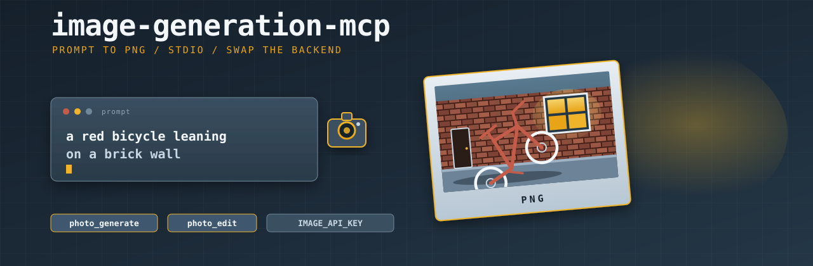

# image-generation-mcp

<p align="center">
  
</p>

Stdio MCP server for image generation. Default backend is Google Nano Banana (Gemini native image models). The package name stays provider-neutral so the backend can change without a rename.

Maps Platform / Workspace OAuth do **not** belong here. Gemini image gen is an API key (or Vertex), same split as `google-maps-mcp`.

Naming contract: [ai-gantry `docs/mcp-naming.md`](https://github.com/shotah/ai-gantry/blob/main/docs/mcp-naming.md).

<p align="center">
  <a href="https://github.com/shotah/image-generation-mcp/actions/workflows/ci.yml"></a>
  <a href="https://github.com/shotah/image-generation-mcp/actions/workflows/release.yml"></a>
  <a href="https://github.com/shotah/image-generation-mcp/actions/workflows/ci.yml"></a>
  <a href="https://pkg.go.dev/github.com/shotah/image-generation-mcp"></a>
  
  <a href="LICENSE"></a>
</p>

## Tools

| Tool | Host name | Auth | What it does |
| --- | --- | --- | --- |
| `photo_generate` | `image__photo_generate` | Gemini / Vertex | Text prompt → PNG (MCP image + JSON summary) |
| `photo_edit` | `image__photo_edit` | Gemini / Vertex | Prompt + `source_path` (or base64) → edited PNG |

JSON summary fields: `prompt`, `model`, `mime`, `bytes`, optional `path` / `note`. Base64 is **not** in the text (hosts truncate tool results). MCP clients that understand image content still get the bytes.

`photo_edit` prefers `source_path` inside `IMAGE_OUTPUT_DIR` so `pendant__avatar_get` → `photo_edit` → `pendant__avatar_update` stays on disk (hosts truncate base64). `source_image` is still accepted for hosts that keep bytes.

Not in v1: extra providers (`IMAGE_PROVIDER` other than `gemini`), URL fetch of `source_image`, Drive upload.

## Auth

API key on this process. The kernel never sees it. Workspace OAuth cannot call Nano Banana.

```bash
export IMAGE_API_KEY="…"          # wins
# or piggyback the crane mouth
export LLM_API_KEY="…"
```

Optional:

| Key | Notes |
| --- | --- |
| `IMAGE_MODEL` | Default `gemini-3.1-flash-image` (Nano Banana 2). Else `LLM_MODEL`. |
| `IMAGE_PROVIDER` | Default `gemini`. Other values teach-in until implemented. |
| `IMAGE_OUTPUT_DIR` | Write PNG/JPEG to disk; summary includes `path`. |
| `GOOGLE_GENAI_USE_VERTEXAI` | Truthy → Vertex. Needs `GOOGLE_CLOUD_PROJECT`. |
| `GOOGLE_CLOUD_LOCATION` | Vertex region; default `global`. |

Enable the Generative Language API (AI Studio) or Vertex Gemini. This is **not** Gmail/Drive consent.

## Install

**Pre-built binary** — grab the archive for your platform from [Releases](https://github.com/shotah/image-generation-mcp/releases):

```bash
tar xzf image-generation-mcp_*_linux_amd64.tar.gz
chmod +x image-generation-mcp
mv image-generation-mcp ~/.local/bin/
```

**Or with Go** (1.26+):

```bash
go install github.com/shotah/image-generation-mcp@latest
```

## Gantry `mcp.toml`

Server id must be **`image`** so hosts expose `image__photo_generate` (do not put `image` on the tool name).

```toml
[[server]]
name = "image"
command = "image-generation-mcp"
download_tag = "latest"
download_url = "https://github.com/shotah/image-generation-mcp/releases/download/{tag}/image-generation-mcp_{version}_{os}_{arch}.tar.gz"
# IMAGE_API_KEY or LLM_API_KEY lives in the gantry process env (child inherits it)
```

`mcp_enable` prefix is `image` (one family: `photo`). Do not enable fat `google` for drawing.

ai-gantry currently stringifies MCP results and truncates to `TOOL_RESULT_MAX_CHARS` (default 6000). The JSON summary is first so it survives. Telegram photo send from those bytes is a host follow-up.

## Development

```bash
make test
make lint
make coverage
make cli
make version          # dry-run: current tag → next patch
make release          # bump VERSION, tag v* + latest, push (BUMP=patch|minor|major)
```

`CGO_ENABLED=0`. Tests stub the provider — no live Google.

## License

[MIT](LICENSE)
